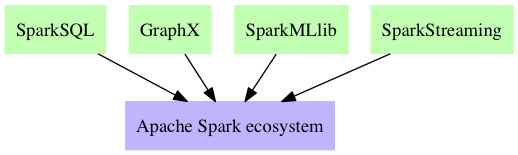
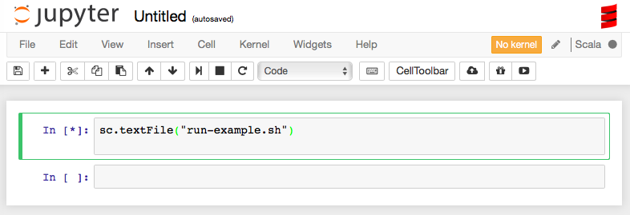

# Spark

Create the `parana/spark` Docker Image 

This **Dockerfile** is a [Automated build](https://hub.docker.com/r/parana/spark/) of [Docker Registry](https://hub.docker.com/).

## Spark Components




## Building on boot2docker & Docker Machine

You need to configure swap space in boot2docker / Docker Machine prior the build:

1. Log into boot2docker / Docker Machine: `boot2docker ssh` or `docker-machine ssh default` (replace `default` if needed).
2. Create a file named `bootlocal.sh` in `/var/lib/boot2docker/` with the following content:

        #!/bin/sh

        SWAPFILE=/mnt/sda1/swapfile

        dd if=/dev/zero of=$SWAPFILE bs=1024 count=2097152
        mkswap $SWAPFILE && chmod 600 $SWAPFILE && swapon $SWAPFILE

3. Make this file executable: `chmod u+x /var/lib/boot2docker/bootlocal.sh`

After restarting boot2docker / Docker Machine, it will have increased swap size.

## How to use


```
docker run -i -t -h my-spark -p 8080:8080 --rm parana/spark bash
```

> You can add `-v $PWD/m2-repo:/root/.m2/repository` in case of use the **host directory** to persist the Maven Local Repository. In this case you need alter Dockerfile properly.

The Container Bash shell will open and you can type:

```
cd /usr/local/spark/sbin
./start-master.sh # starting org.apache.spark.deploy.master.Master, logging to /usr/local/spark/logs/
ps -ef | grep java 
ls -lAt /usr/local/spark/logs
cat /usr/local/spark/logs/* | grep "Starting Spark master at"
# Write the spark URL to remember (suppose: "spark://my-spark:7077")
cat /usr/local/spark/logs/* | grep port
# Use the URL of Master to start the Slave
./start-slave.sh spark://my-spark:7077
# Test the master’s web UI
sleep 5
curl http://localhost:8080
```

### Using Spark

> Most of this content is from Spark Documentation for 2.0.2 version avaiable in [http://spark.apache.org/docs/2.0.2/](http://spark.apache.org/docs/2.0.2/), but properly organized for Data Science professionals.

Open on WEB Browser in host computer

```
http://localhost:8080
```

You will see something like this.


#### Interactive Analysis with the Spark Shell

Spark’s shell provides a simple way to learn the API, as well as a powerful tool 
to analyze data interactively. It is available in Scala which runs on the Java VM 
and is thus a good way to use existing Java libraries. Start it by running the 
following in the Spark directory:

```bash
spark-shell
```

Spark’s primary abstraction is a distributed collection of items called a 
Resilient Distributed Dataset (RDD). RDDs can be created from Hadoop 
InputFormats (such as HDFS files) or by transforming other RDDs. Let’s make 
a new RDD from the text of the README file in the Spark source directory:

```scala
val textFile = sc.textFile("../README.md")
```

```
textFile: org.apache.spark.rdd.RDD[String] = README.md MapPartitionsRDD[1] at textFile at <console>:25
```
RDDs have actions, which return values, and transformations, which return 
pointers to new RDDs. Let’s start with a few actions:

```scala
textFile.count() // Number of items in this RDD
res0: Long = 126
```

```scala
textFile.first() // First item in this RDD
res1: String = # Apache Spark
```

Now let’s use a transformation. We will use the filter transformation to return 
a new RDD with a subset of the items in the file.

```scala
val linesWithSpark = textFile.filter(line => line.contains("Spark"))
linesWithSpark: org.apache.spark.rdd.RDD[String] = MapPartitionsRDD[2] at filter at <console>:27
```

We can chain together transformations and actions:

```scala
textFile.filter(line => line.contains("Spark")).count() // How many lines contain "Spark"?
res3: Long = 15
```

#### More on RDD Operations

RDD actions and transformations can be used for more complex computations. 

Let’s say we want to find the line with the most words:

```scala
textFile.map(line => line.split(" ").size).reduce((a, b) => if (a > b) a else b)
```

This first maps a line to an integer value, creating a new RDD. Method reduce is 
called on that RDD to find the largest line count. The arguments to map and 
reduce are Scala function literals (closures), and can use any language 
feature or Scala/Java library. For example, we can easily call functions 
declared elsewhere. We’ll use Math.max() function to make this code easier 
to understand:


```scala
import java.lang.Math
textFile.map(line => line.split(" ").size).reduce((a, b) => Math.max(a, b))
res5: Int = 15
```

One common data flow pattern is MapReduce, as popularized by Hadoop. Spark 
can implement MapReduce flows easily:

```scala
val wordCounts = textFile.flatMap(line => line.split(" ")).map(word => (word, 1)).reduceByKey((a, b) => a + b)
wordCounts: org.apache.spark.rdd.RDD[(String, Int)] = ShuffledRDD[8] at reduceByKey at <console>:28
```

Here, we combined the flatMap, map, and reduceByKey transformations to compute 
the per-word counts in the file as an RDD of (String, Int) pairs. To collect 
the word counts in our shell, we can use the collect action:

```scala
wordCounts.collect()
res6: Array[(String, Int)] = Array((means,1), (under,2), (this,3), (Because,1), (Python,2), (agree,1), (cluster.,1), ...)
```

#### Caching

Spark also supports pulling data sets into a cluster-wide in-memory cache. This 
is very useful when data is accessed repeatedly, such as when querying a 
small “hot” dataset or when running an iterative algorithm like PageRank. 

As a simple example, let’s mark our `linesWithSpark` dataset to be cached:

```scala
linesWithSpark.cache()
res7: linesWithSpark.type = MapPartitionsRDD[2] at filter at <console>:27
```

```scala
linesWithSpark.count()
res8: Long = 19
```

It may seem silly to use Spark to explore and cache a 100-line text file. The 
interesting part is that these same functions can be used on very large data 
sets, even when they are striped across tens or hundreds of nodes. You can 
also do this interactively by connecting `bin/spark-shell` to a cluster, as 
described in the 
[programming guide](http://spark.apache.org/docs/latest/programming-guide.html).

#### Self-Contained Java Applications

Suppose we wish to write a self-contained application using the Spark API. We 
will walk through a simple application in Java (with Maven).

This example will use Maven to compile an application JAR, but any similar 
build system will work.

We’ll create a very simple Spark application, `SimpleApp.java`:

```java
/* SimpleApp.java */
import org.apache.spark.api.java.*;
import org.apache.spark.SparkConf;
import org.apache.spark.api.java.function.Function;

public class SimpleApp {
  public static void main(String[] args) {
    // logFile Should be some file on your system
    String logFile = "/usr/local/spark/README.md"; 
    SparkConf conf = new SparkConf().setAppName("Simple Application");
    JavaSparkContext sc = new JavaSparkContext(conf);
    JavaRDD<String> logData = sc.textFile(logFile).cache();

    long numAs = logData.filter(new Function<String, Boolean>() {
      public Boolean call(String s) { return s.contains("a"); }
    }).count();

    long numBs = logData.filter(new Function<String, Boolean>() {
      public Boolean call(String s) { return s.contains("b"); }
    }).count();

    System.out.println("Lines with a: " + numAs + ", lines with b: " + numBs);
  }
}

```

This program just counts the number of lines containing ‘a’ and the number 
containing ‘b’ in a text file. Note that you’ll need to replace 
/usr/local/spark with the location where Spark is installed (if you will
run this code in another environment). 

As with the Scala example, we initialize a SparkContext, though we use the 
special JavaSparkContext class to get a Java-friendly one. 

We also create **RDDs** (represented by JavaRDD) and run transformations on 
them. Finally, we pass functions to Spark by creating classes that extend 
spark.api.java.function.Function. The Spark programming guide describes these 
differences in more detail.

To build the program, we also write a Maven pom.xml file that lists Spark as a 
dependency. 

```xml
<project xmlns="http://maven.apache.org/POM/4.0.0" 
  xmlns:xsi="http://www.w3.org/2001/XMLSchema-instance"
  xsi:schemaLocation="http://maven.apache.org/POM/4.0.0 http://maven.apache.org/xsd/maven-4.0.0.xsd">
  <modelVersion>4.0.0</modelVersion>
  <groupId>br.com.joao-parana</groupId>
  <artifactId>myspark</artifactId>
  <version>1.0-SNAPSHOT</version>
  <packaging>jar</packaging>
  <name>myspark</name>
  <url>http://maven.apache.org</url>
  <properties>
    <project.build.sourceEncoding>UTF-8</project.build.sourceEncoding>
  </properties>
  <dependencies>
    <dependency> <!-- Spark dependency -->
      <groupId>org.apache.spark</groupId>
      <artifactId>spark-core_2.11</artifactId>
      <version>2.0.2</version>
    </dependency>
    <dependency>
      <groupId>junit</groupId>
      <artifactId>junit</artifactId>
      <version>4.8.1</version>
      <scope>test</scope>
    </dependency>
  </dependencies>
</project>
```

This project is already created at /desenv/java/myspark, so now you can run 
this Java Program using :

```bash
cd /desenv/java/myspark
/usr/local/spark/bin/spark-submit \
    --class "spark.SimpleApp" \
    --master local[4] \
    target/myspark-1.0-SNAPSHOT.jar 2> /dev/null 
```

See `Dockerfile` for details about where this files are located in host 
computer. For example:

```bash
COPY test /desenv/java/
```


#### Where to Go from Here

Congratulations on running your first Spark application!

For an in-depth overview of the API, start with the 
[Spark programming guide](http://spark.apache.org/docs/latest/programming-guide.html), 
or see “Programming Guides” menu for other components like : **MLlib** 
for _Machine Learning_ API.

For running applications on a cluster, head to the deployment overview.

Finally, Spark includes several samples in the examples directory (Scala, 
Java, Python, R). You can run them as follows:


```bash
# For Scala and Java, use run-example:
/usr/local/spark/bin/run-example SparkPi
```

This shell `run-example` delegate the execution to 
`/usr/local/spark/bin/spark-class` which invoke the class
`org.apache.spark.deploy.SparkSubmit` passing all parameters.

In the other hand this shell `spark-class` ensure the environment is set 
running load-spark-env.sh, find Spark jars, set the LAUNCH_CLASSPATH variable
and build the command to be executed. Then start JVM to run the command.

In this case of running `SparkPi` the command build is something like this:

```bash
/opt/jdk1.8.0_91/bin/java \
    -cp /usr/local/spark/conf/:/usr/local/spark/jars/* \
    -Xmx1g \
    org.apache.spark.deploy.SparkSubmit \
    --jars /usr/local/spark/examples/jars/scopt_2.11-3.3.0.jar,/usr/local/spark/examples/jars/spark-examples_2.11-2.0.2.jar \
    --class org.apache.spark.examples.SparkPi spark-internal

```

So, you can use `/desenv/java/run-example.sh SparkPi` to run SparkPi example.


#### Launching Spark jobs from Java or Scala

The org.apache.spark.launcher package provides classes for launching Spark 
jobs as child processes using a simple Java API.

#### Unit Testing

Spark is friendly to unit testing with any popular unit test framework. 
Simply create a SparkContext in your test with the master URL set to local, 
run your operations, and then call SparkContext.stop() to tear it down. 
Make sure you stop the context within a finally block or the test 
framework’s tearDown method, as Spark does not support two contexts 
running concurrently in the same program.

Some examples:

```java
package spark;

import static org.junit.Assert.*;
import java.io.IOException;
import java.util.*;
import org.apache.spark.SparkConf;
import org.apache.spark.api.java.*;
import org.junit.*;

public class SimpleTest {
  private JavaSparkContext sparkCtx;

  @Before
  public void init() throws IllegalArgumentException, IOException {
    // ctxtBuilder = new ContextBuilder(tempFolder);
    SparkConf conf = new SparkConf();
    conf.setMaster("local[2]");
    conf.setAppName("junit");
    this.sparkCtx = new JavaSparkContext(conf);
  }

  @Test
  public void testSimpleRdd() {
    final List<Integer> nums = new ArrayList<Integer>();
    nums.add(3);
    nums.add(4);
    nums.add(2);
    JavaRDD<Integer> rdd = this.sparkCtx.parallelize(nums, 1);
    assertEquals(3, rdd.count());
  }
}
```

Using SparkSession (please, add `spark-sql_2.11` dependency in your pom)

```java
package spark;

import static org.apache.spark.sql.functions.*;
import java.io.IOException;
import java.util.List;
import org.apache.spark.sql.*;
import org.junit.*;

public class CsvTest {
  private SparkSession sparkSession;

  @Before
  public void init() throws IllegalArgumentException, IOException {
    this.sparkSession = SparkSession.builder().master("local").appName("spark session example").getOrCreate();
  }

  @Test
  public void tesCsv() {
    Dataset<Row> dataset = this.sparkSession.read().format("csv").option("header", "true").option("", "")
        .load("/tmp/data.csv");
    
    List<Row> l = dataset.collectAsList();
    String columns[] = { "Nome", "Idade" };
    for (Row row : l) {
      int s = row.length();
      for (int i = 0; i < s; i++) {
        System.out.println(columns[i] + " : " + row.getString(i));
      }
    }
    dataset.printSchema();
  }
}
```

In this examples I'm using some Functions available for DataFrame. 
See this link [https://spark.apache.org/docs/2.0.2/api/java/org/apache/spark/sql/functions.html](https://spark.apache.org/docs/2.0.2/api/java/org/apache/spark/sql/functions.html) 
for details.


```java
package spark;

import static org.apache.spark.sql.functions.*;
import java.io.IOException;
import java.util.List;
import org.apache.spark.sql.*;
import org.junit.*;

public class CsvTest2 {
  private SparkSession sparkSession;

  @Before
  public void init() throws IllegalArgumentException, IOException {
    this.sparkSession = SparkSession.builder().master("local").appName("spark session example").getOrCreate();
  }

  @Test
  public void tesCsv() {
    Dataset<Row> dataset = this.sparkSession.read().format("csv").option("header", "true").option("", "")
        .load("/tmp/data2.csv");
    
    List<Row> l = dataset.collectAsList();
    // String title[] = { "Nome", "Nota" };
    for (Row row : l) {
      int s = row.length();
      for (int i = 0; i < s; i++) {
        // System.out.println(columns[i] + " : " + row.getString(i));
      }
    }
    String title[] = { "Nome", "stdDev(Nota)" };
    dataset.printSchema();
    Dataset<Row> stddev = dataset.groupBy("Nome").agg(stddev_pop("Nota"));
    System.out.println(stddev);
    l = stddev.collectAsList();
    for (Row row : l) {
      int s = row.length();
      for (int i = 0; i < s; i++) {
        Object value;
        try {
          value = row.getDouble(i);
        } catch (Exception e) {
          value = row.getString(i);
        }
        System.out.println(title[i] + " : " + value);
      }
    }
  }
}
```

#### Spark SQL 

Spark SQL is a Spark module for structured data processing. Unlike the basic 
Spark RDD API, the interfaces provided by Spark SQL provide Spark with more 
information about the structure of both the data and the computation being 
performed. Internally, Spark SQL uses this extra information to perform 
**extra optimizations**. There are several ways to interact with Spark SQL 
including SQL and the Dataset API. When computing a result the same execution 
engine is used, independent of which API/language you are using to express 
the computation. This unification means that developers can easily switch 
back and forth between different APIs based on which provides the most 
natural way to express a given transformation.

One use of Spark SQL is to execute SQL queries. Spark SQL can also be used 
to read data from an existing Apache Hive installation (see section bellow). 
When running SQL from within another programming language, like Java, the 
results will be returned as a Dataset/DataFrame. You can also interact with 
the SQL interface using the command-line or over JDBC/ODBC.

##### Running SQL Queries Programmatically

The sql function on a SparkSession enables applications to run SQL queries 
programmatically and returns the result as a Dataset<Row>.

```java
import org.apache.spark.sql.Dataset;
import org.apache.spark.sql.Row;

// Start with JSON Dataset
Dataset<Row> df = spark.read().json("examples/src/main/resources/people.json");
// Print the schema in a tree format
df.printSchema();
// root
// |-- age: long (nullable = true)
// |-- name: string (nullable = true)

// Now the same Schema on SQL Database.

// Register the DataFrame as a SQL temporary view
df.createOrReplaceTempView("people");

Dataset<Row> sqlDF = spark.sql("SELECT * FROM people");
sqlDF.show();

// +----+-------+
// | age|   name|
// +----+-------+
// |null|Michael|
// |  30|   Andy|
// |  19| Justin|
// +----+-------+

// Count people by age
sqlDF.groupBy("age").count().show();
// +----+-----+
// | age|count|
// +----+-----+
// |  19|    1|
// |null|    1|
// |  30|    1|
// +----+-----+

```

Find full example code at "examples/src/main/java/org/apache/spark/examples/sql/JavaSparkSQLExample.java" in the Spark Github repo.


#### Persistence with Apache Hive

Spark use Apache Hive SQL Persistence layer. 

The Apache Hive data warehouse software facilitates reading, writing, and 
managing large datasets residing in distributed storage using SQL. 
Hive is built on top of Apache Hadoop.

See [distributed sql engine](http://spark.apache.org/docs/latest/sql-programming-guide.html#distributed-sql-engine)
for details.

#### More on Spark 2.0

[http://blog.madhukaraphatak.com/categories/spark-two](http://blog.madhukaraphatak.com/categories/spark-two/)

To convert the code from **Scala** to **Java** use this **pom.xml** dependencies :

```xml
  <dependencies>
    <dependency> <!-- Spark dependency -->
      <groupId>org.apache.spark</groupId>
      <artifactId>spark-core_2.11</artifactId>
      <version>2.0.2</version>
    </dependency>
    <dependency>
    <groupId>org.apache.spark</groupId>
    <artifactId>spark-sql_2.11</artifactId>
    <version>2.0.2</version>
  </dependency>
    <!-- 
    Others useful dependencies:
    http://search.maven.org/#search%7Cga%7C1%7Cg%3A%22org.apache.spark%22%20AND%20v%3A%222.0.0%22
    
    spark-mllib_2.11
    spark-streaming_2.11
    spark-hive_2.11
    -->
    <dependency> <!-- Hadoop dependency -->
      <groupId>org.apache.hadoop</groupId>
      <artifactId>hadoop-client</artifactId>
      <version>2.7.3</version>
    </dependency>
    . . . 
```

## How to build

If you plan to change the Spark version on the pom.xml file you will need
to re-create the `m2-repo` directory again. To do this use the command 
below to start the container.

```bash
mv m2-repo m2-repo-old

docker run -i -t -h my-spark --rm \
       --name my-spark \
       -v $PWD/m2-repo:/root/.m2/repository \
       -p 8080:8080 \
       -p 7077:7077 \
       parana/spark bash

rm -rf m2-repo-old
```

Doing this m2-repo will be updated on Host and a next build will be much
faster because it will use the artifacts in the **Local Maven Repository**
and will not need to download again.

## Using Jupyter Notebook

Run this comand below on Container Bash prompt.

```bash
jupyter notebook --no-browser --ip spark.local
```

and `open http://spark.local:8888` on host computer.


Then, you can see on host computer something like this:




